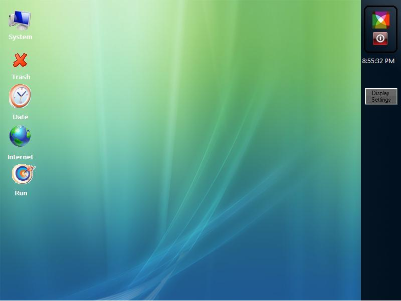



## Starsoft Xtreme OS Home Edition

### Description

Starsoft Xtreme Operating System is a Desktop Operating System created in Visual Basic 6.0

and works in Windows XP Base.

it's an amazing GUI operating system which satisfy all your needs.

it is embeded with neumerous of Applications,Games and Act as a Basic as well as Home based Operating System

Starsoft Xtreme OS provides you a shell core which is much stable than the present day operating system.

This operating system is highly Graphicallized, then also work in minimal memmory.

Starsoft Xtreme Enables you to install your own applications.

----

Applications

----

Starsoft Xtreme I Xplorer

File Browser

Starsoft Xtreme File Browser

DVD\CD Tray Opener &amp; Closer

Starsoft Xtreme Process Manager

----

--Office

----

Starsoft Xtreme Digital Book 2000

Starsoft Xtreme Digital Book 2008

Starsoft Xtreme Web Editor

Starsoft Xtreme Quick Mailer

Starsoft Xtreme Wonder HTML

Starsoft Xtreme Glaze Paint

Starsoft Xtreme Advanced Paint

Starsoft Xtreme Word Processor 2008

Starsoft Xtreme Calculator

Starsoft Xtreme 3D Motion + Morphing Model System

----

--Games

----

Coloroids 2

Navel Battle

----

--Security

----

Starsoft Xtreme Virus Buster 2008

Starsoft Xtreme Folder Security

Starsoft Xtreme Ultravire File Encrypter

Starsoft Xtreme Ultravires Safe Note

----

--Multimedia

----

Starsoft Xtreme MP3 Player

Thunder MP3

Starsoft Xtreme Multimedia Vedio Player

----

--Utlities

----

Starsoft Xtreme Cab Eplorer

Easy Web Page Brander

HTML Song Attacher

Sheduler

Directory Back Up Utlity

Starsoft xtreme Get Icon

FRM File Extension Searcher

----

 
### More Info
 

             |
---                |---
**Submitted On**   |2008-03-13 15:15:22
**By**             |[Ajin Abraham](https://github.com/Planet-Source-Code/PSCIndex/blob/master/ByAuthor/ajin-abraham.md)
**Level**          |Advanced
**User Rating**    |4.8 (38 globes from 8 users)
**Compatibility**  |VB 6\.0
**Category**       |[Complete Applications](https://github.com/Planet-Source-Code/PSCIndex/blob/master/ByCategory/complete-applications__1-27.md)
**World**          |[Visual Basic](https://github.com/Planet-Source-Code/PSCIndex/blob/master/ByWorld/visual-basic.md)
**Archive File**   |[Starsoft\_X2106123152008\.zip](https://github.com/Planet-Source-Code/ajin-abraham-starsoft-xtreme-os-home-edition__1-70272/archive/master.zip)

